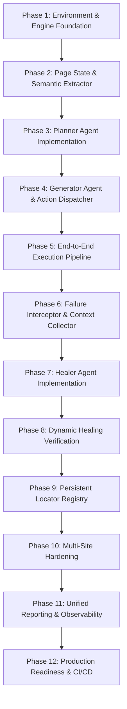

# Implementation Plan: Autonomous Agentic Playwright Test Automation Framework

This document outlines the detailed architectural blueprints, modular directory structures, data schemas, and step-by-step 12-phase implementation roadmap for developing the **Autonomous Agentic Playwright Test Automation Framework**.

---

## 1. System Architecture & Component Design

The framework follows a decoupled, single-responsibility agentic architecture in TypeScript (Node.js v20+ LTS).

```
                      +-----------------------------------+
                      |      CLI / Scenario Ingestor      |
                      +-----------------------------------+
                                        │
                                        ▼
                      +-----------------------------------+
                      |          Planner Agent            |
                      |  - Ingests User Scenario          |
                      |  - Emits Zod TestPlanSchema       |
                      +-----------------------------------+
                                        │
                                        ▼
+-----------------------------------------------------------------------------------+
|                           Execution Orchestrator                                  |
|                                                                                   |
|  +------------------------+      +-------------------+      +------------------+  |
|  | Page State Extractor   | ---> | Generator Agent   | ---> | Playwright       |  |
|  | - aria-snapshot        |      | - Resolves target |      | Execution Engine |  |
|  | - Interactive elements |      | - Synthesizes cmd |      | - Dispatches act |  |
|  +------------------------+      +-------------------+      +------------------+  |
|                                                                      │            |
|                                                                   [FAIL]          |
|                                                                      │            |
|  +------------------------+      +-------------------+               ▼            |
|  | Persistent Registry    | <--- |   Healer Agent    | <--- +------------------+  |
|  | - locator.registry.json|      | - Diagnoses drift |      | Failure          |  |
|  | - Applied selector     |      | - Verifies patch  |      | Interceptor      |  |
|  +------------------------+      +-------------------+      +------------------+  |
+-----------------------------------------------------------------------------------+
                                        │
                                        ▼
                      +-----------------------------------+
                      |  Unified Reporter & Observability |
                      |  - HTML Reports & Trace Viewer    |
                      |  - Self-Healing Audit Diff Log    |
                      +-----------------------------------+
```

---

## 2. Directory & Directory Structure Blueprint

```text
playwrightFramework01/
├── config/
│   ├── framework.config.ts         # Global timeouts, browser options, env config
│   └── locator.registry.json       # Persistent cached locator store
├── scenarios/                      # Test requirement inputs
│   ├── purchase_flow.md            # Sample markdown user story
│   └── login_verification.txt      # Sample plain text scenario
├── src/
│   ├── index.ts                    # Main programmatic entry point
│   ├── cli.ts                      # Command-line interface parser
│   ├── schemas/
│   │   ├── plan.schema.ts          # Zod schema for TestPlan & Atomic Steps
│   │   ├── snapshot.schema.ts      # Zod schema for Page Accessibility Trees
│   │   ├── registry.schema.ts      # Zod schema for Locator Registry entries
│   │   └── healing.schema.ts       # Zod schema for Self-Healing Audits
│   ├── agents/
│   │   ├── base.agent.ts           # Abstract Base LLM Agent (OpenAI/Anthropic wrappers)
│   │   ├── planner.agent.ts        # Planner Agent implementation
│   │   ├── generator.agent.ts      # Generator Agent implementation
│   │   └── healer.agent.ts         # Healer Agent implementation
│   ├── extractor/
│   │   ├── dom.extractor.ts        # Dynamic DOM & Accessibility tree extractor
│   │   └── aria.snapshot.ts        # Compact ARIA snapshot builder
│   ├── engine/
│   │   ├── browser.manager.ts      # Playwright browser/context lifecycle manager
│   │   ├── action.dispatcher.ts    # Playwright action & assertion dispatcher
│   │   └── failure.interceptor.ts  # Runtime exception interceptor & context collector
│   ├── orchestrator/
│   │   └── pipeline.ts             # Main execution flow controller
│   ├── utils/
│   │   ├── logger.ts               # Structured logging utility
│   │   └── mask.util.ts            # PII & Credential masking utility
│   └── reporter/
│       ├── html.reporter.ts        # Interactive execution report generator
│       └── audit.reporter.ts       # Self-healing audit diff log writer
├── tests/
│   ├── unit/                       # Unit tests for agents & extractors
│   └── integration/                # E2E framework verification tests
├── package.json
├── tsconfig.json
└── README.md
```

---

## 3. Data Models & Zod Schemas

To guarantee deterministic system behavior, all agent outputs and framework messages are validated against strict Zod schemas.

### 3.1 Test Plan Schema (`src/schemas/plan.schema.ts`)
```typescript
import { z } from 'zod';

export const StepIntentSchema = z.enum([
  'ACTION_NAVIGATE',
  'ACTION_CLICK',
  'ACTION_TYPE',
  'ACTION_SELECT',
  'ACTION_HOVER',
  'ACTION_PRESS_KEY',
  'ASSERT_VISIBLE',
  'ASSERT_TEXT_EQUALS',
  'ASSERT_URL_CONTAINS'
]);

export const AtomicStepSchema = z.object({
  stepId: z.string().describe('Unique step identifier, e.g., step_001'),
  intent: StepIntentSchema.describe('Action or assertion intent'),
  targetDescription: z.string().describe('Human-readable target element description'),
  inputValue: z.string().optional().describe('Input value for typing or selecting'),
  expectedValue: z.string().optional().describe('Expected text or URL value for assertion'),
  criticality: z.enum(['CRITICAL', 'OPTIONAL']).default('CRITICAL'),
  timeoutMs: z.number().default(30000)
});

export const TestPlanSchema = z.object({
  planId: z.string(),
  scenarioTitle: z.string(),
  baseUrl: z.string().url(),
  prerequisites: z.array(z.string()).default([]),
  steps: z.array(AtomicStepSchema),
  cleanup: z.array(z.string()).default([])
});

export type AtomicStep = z.infer<typeof AtomicStepSchema>;
export type TestPlan = z.infer<typeof TestPlanSchema>;
```

### 3.2 Locator Registry Schema (`src/schemas/registry.schema.ts`)
```typescript
import { z } from 'zod';

export const RegistryEntrySchema = z.object({
  targetKey: z.string().describe('Unique hashed target description key'),
  lastKnownLocator: z.string().describe('Primary Playwright selector'),
  fallbackLocators: z.array(z.string()).default([]),
  lastVerified: z.string().datetime(),
  successfulRuns: z.number().default(1)
});

export const LocatorRegistrySchema = z.record(z.string(), RegistryEntrySchema);
export type LocatorRegistry = z.infer<typeof LocatorRegistrySchema>;
```

### 3.3 Healing Audit Schema (`src/schemas/healing.schema.ts`)
```typescript
import { z } from 'zod';

export const HealingReportSchema = z.object({
  timestamp: z.string(),
  stepId: z.string(),
  originalLocator: z.string(),
  failureErrorType: z.string(),
  healedLocator: z.string(),
  confidenceScore: z.number().min(0).max(1),
  healingStatus: z.enum(['SUCCESS', 'FAILED_CANNOT_REPAIR', 'FAILED_GENUINE_BUG']),
  domDiffSummary: z.string()
});

export type HealingReport = z.infer<typeof HealingReportSchema>;
```

---

## 4. Phased Implementation Roadmap

The development of the framework is divided into 12 structured phases.



### Phase 1: Environment & Playwright Engine Foundation
* **Goal**: Establish the base TypeScript configuration, CLI interface, and Playwright browser lifecycle manager.
* **Tasks**:
  1. Initialize Node.js TypeScript project (`tsconfig.json`, `package.json`).
  2. Implement `BrowserManager` (`src/engine/browser.manager.ts`) to manage Chromium, Firefox, and WebKit browser contexts.
  3. Set up environment loading (`dotenv`) and standard CLI argument parsing (`commander`).
* **Verification**: Run unit tests ensuring browser launch, context isolation, and clean teardown across Chromium, Firefox, and WebKit.

### Phase 2: Page State & Semantic DOM Extractor
* **Goal**: Extract compact, token-efficient representations of live page states.
* **Tasks**:
  1. Implement `DOMExtractor` (`src/extractor/dom.extractor.ts`) to generate Playwright `aria-snapshot` strings.
  2. Filter interactive elements (buttons, inputs, links, dropdowns) with spatial bounding boxes and visibility checks.
  3. Enforce context window token budgeting (< 4,000 tokens per page snapshot).
* **Verification**: Test extractor on complex SPAs (React/SauceDemo) and ensure extracted snapshots capture interactive elements accurately.

### Phase 3: Planner Agent Implementation
* **Goal**: Build the agent that converts plain text/markdown scenarios into atomic execution plans.
* **Tasks**:
  1. Implement `PlannerAgent` (`src/agents/planner.agent.ts`) with OpenAI/Anthropic SDKs.
  2. System prompt engineering instructing the LLM to output valid JSON matching `TestPlanSchema`.
  3. Implement schema validation retry logic if LLM output fails `TestPlanSchema.parse()`.
* **Verification**: Ingest sample scenario files (`.md`, `.txt`) and verify synthesized atomic step graphs.

### Phase 4: Generator Agent & Action Dispatcher
* **Goal**: Translate atomic step intents into concrete Playwright actions at runtime.
* **Tasks**:
  1. Implement `GeneratorAgent` (`src/agents/generator.agent.ts`) to map step intent + ARIA snapshot to concrete locators.
  2. Implement `ActionDispatcher` (`src/engine/action.dispatcher.ts`) supporting `click`, `fill`, `selectOption`, `expect().toBeVisible()`.
  3. Integrate auto-wait handling for network idle and DOM stability.
* **Verification**: Execute generated actions against live pages and confirm element interactions.

### Phase 5: End-to-End Dynamic Execution Pipeline
* **Goal**: Connect Planner, Generator, and Dispatcher in a unified pipeline orchestrator.
* **Tasks**:
  1. Implement `PipelineOrchestrator` (`src/orchestrator/pipeline.ts`).
  2. Implement main execution loop: Step Plan $\rightarrow$ State Extraction $\rightarrow$ Action Generation $\rightarrow$ Action Dispatch.
  3. Record execution metrics (duration, success status, token count).
* **Verification**: Run an end-to-end test from plain-text scenario to completed browser session.

### Phase 6: Failure Interceptor & Context Collector
* **Goal**: Intercept Playwright runtime failures and capture diagnostic context.
* **Tasks**:
  1. Implement `FailureInterceptor` (`src/engine/failure.interceptor.ts`).
  2. Hook runtime exceptions (`TimeoutError`, `ElementHandleNotFound`, `AssertionError`).
  3. Capture failure state: failure screenshot, DOM mutation snapshot, stack trace, and failed step metadata.
* **Verification**: Simulate a missing element failure and verify diagnostic context object generation.

### Phase 7: Healer Agent Implementation
* **Goal**: Develop diagnostic reasoning engine to repair broken element selectors dynamically.
* **Tasks**:
  1. Implement `HealerAgent` (`src/agents/healer.agent.ts`).
  2. Pass failed locator, screenshot, stack trace, and updated DOM snapshot to Healer Agent.
  3. Instruct Healer Agent to analyze element drift and generate alternative Playwright selector candidates.
* **Verification**: Intentionally alter element IDs in test DOMs and confirm Healer Agent outputs valid replacement candidates.

### Phase 8: Dynamic Healing Verification & Execution Resume
* **Goal**: Validate replacement selectors live in the browser and resume test execution.
* **Tasks**:
  1. Verify candidates against live page (check uniqueness `count() === 1` and actionability `isVisible()`).
  2. Re-dispatch failed action using verified repaired selector.
  3. Resume execution pipeline if repair succeeds; abort and log bug if repair fails or confidence score $< 0.80$.
* **Verification**: Test automated recovery from broken locators on dynamic demo sites.

### Phase 9: Persistent Locator Registry & Patching
* **Goal**: Cache verified locators to prevent redundant LLM locator generation.
* **Tasks**:
  1. Implement `LocatorRegistry` (`config/locator.registry.json` manager).
  2. Save verified healed locators with target hashes and success counts.
  3. Implement lookup logic in Generator Agent to query registry before LLM inference.
* **Verification**: Re-run scenarios with modified DOMs and verify cached locators are applied instantly without LLM calls.

### Phase 10: Multi-Site Hardening & Complex UI Scenarios
* **Goal**: Ensure compatibility across dynamic web frameworks and complex DOM structures.
* **Tasks**:
  1. Add support for Shadow DOM traversal (`pierce` selector strategies).
  2. Handle nested `iframe` frame switching and context switching.
  3. Optimize waiting mechanics for heavy React/Angular SPA hydration delays.
* **Verification**: Execute test scenarios across multi-frame and Shadow DOM demo web applications.

### Phase 11: Unified Reporting & Observability
* **Goal**: Aggregate traces, logs, and self-healing diffs into user-facing reports.
* **Tasks**:
  1. Implement `HTMLReporter` (`src/reporter/html.reporter.ts`) producing interactive execution dashboards.
  2. Implement `AuditReporter` (`src/reporter/audit.reporter.ts`) generating self-healing JSON logs.
  3. Standardize Playwright `trace.zip` export.
* **Verification**: Verify generated HTML reports open properly in standard web browsers.

### Phase 12: Production Readiness & CI/CD
* **Goal**: Package framework for production CI/CD containerized execution.
* **Tasks**:
  1. Create production `Dockerfile` with Playwright dependencies pre-installed.
  2. Configure GitHub Actions and GitLab CI job templates.
  3. Conduct security audit for credential masking and secret protection.
* **Verification**: Execute headless multi-browser test suite inside isolated Docker container.

---

## 5. Security & Masking Specifications

To safeguard credentials and sensitive information:
1. **Prompt Sanitization**: The `MaskUtil` (`src/utils/mask.util.ts`) scans requirements and DOM snapshots for secret patterns (`password`, `token`, `key`) and replaces them with `***MASKED***` prior to sending payloads to LLM APIs.
2. **Log Redaction**: All framework logger outputs strip sensitive values automatically.
3. **Artifact Protection**: Screenshots and Playwright traces are scrubbed of sensitive environment variables injected during execution.
