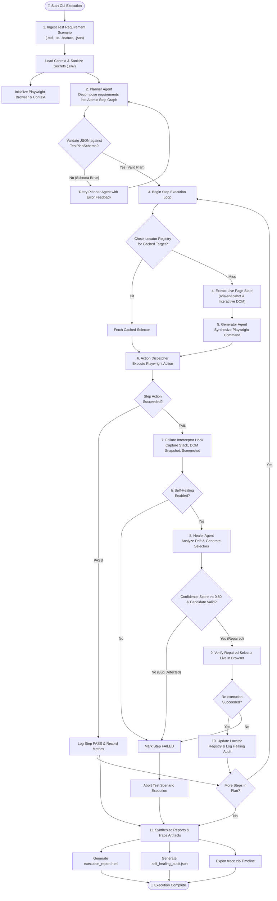
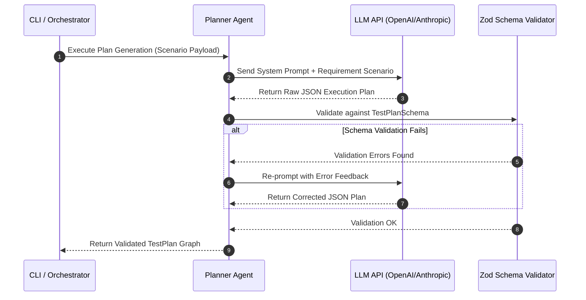
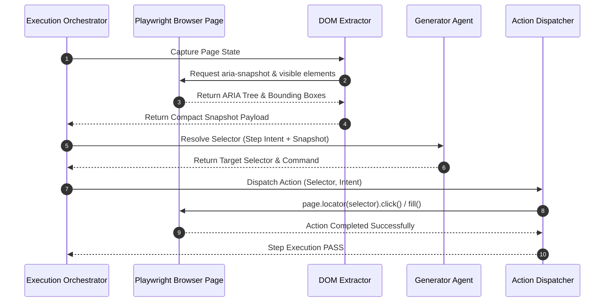
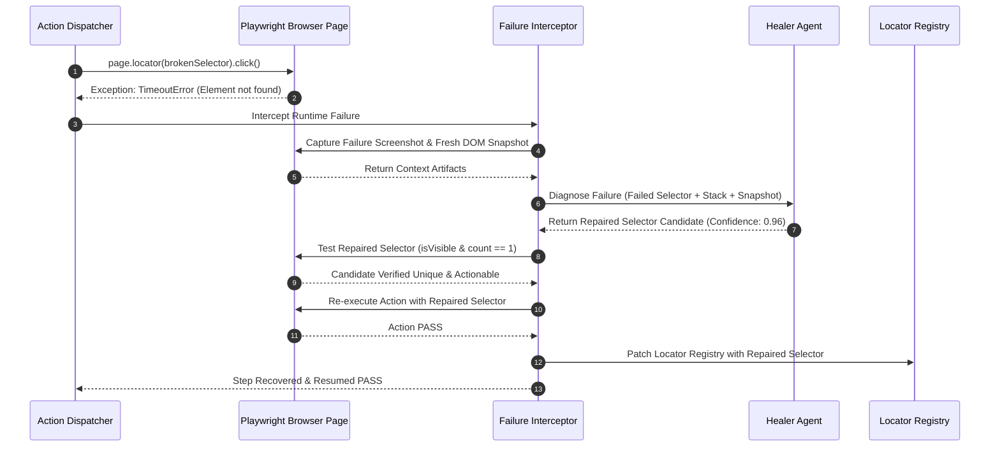
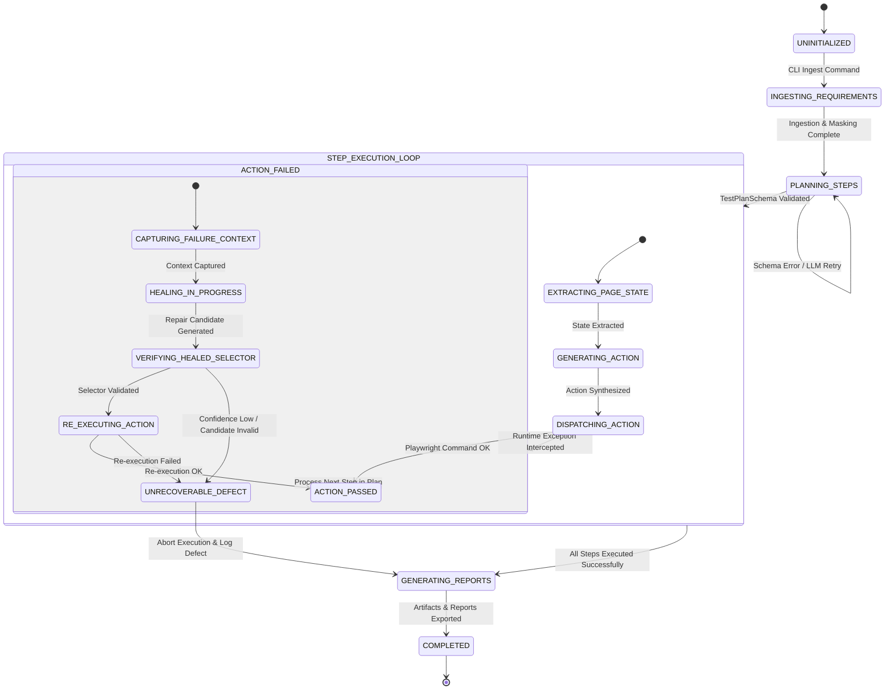

# Workflow Documentation: Autonomous Agentic Playwright Test Automation Framework

This document provides a complete conceptual and operational guide to the end-to-end execution workflow, decision trees, agent communication protocols, and state machines powering the **Autonomous Agentic Playwright Test Automation Framework**.

---

## 1. End-to-End Execution Flowchart

The following flowchart maps the complete lifecycle of a test execution run from requirement ingestion to final reporting.

---

## 2. Detailed Workflow Lifecycle Stages

### Stage 1: Input Ingestion & Environment Setup
1. **Scenario Loading**: The framework CLI receives the path to a scenario file (`--spec scenarios/purchase_flow.md`).
2. **Format Ingestion**: The requirement parser normalizes Markdown, Gherkin, plain text, or JSON into a unified string payload.
3. **Security Masking**: The `MaskUtil` scans for sensitive patterns (passwords, tokens, API keys) and redacts them prior to agent transmission.
4. **Browser Provisioning**: The `BrowserManager` launches a fresh, isolated browser context (Chromium, Firefox, or WebKit) based on CLI arguments.

---

### Stage 2: Intent Planning Phase (Planner Agent)
1. **Prompt Synthesis**: The scenario text is combined with system prompt constraints instructing the LLM to act as a QA Lead.
2. **Atomic Graph Generation**: The Planner Agent decomposes the scenario into discrete, state-aware steps (`ACTION_NAVIGATE`, `ACTION_TYPE`, `ACTION_CLICK`, `ASSERT_TEXT_EQUALS`).
3. **Zod Schema Validation**: The output is validated against `TestPlanSchema`. If structural or field validation fails, the error is fed back to the LLM for immediate correction.

---

### Stage 3: Live Page Extraction & Action Generation
1. **Page Inspection**: For each atomic step, the `DOMExtractor` extracts the active page's Accessibility Tree using Playwright's `aria-snapshot`.
2. **Registry Lookup**: The orchestrator checks `locator.registry.json` for a previously verified selector matching the target description.
3. **Action Generation**: If not cached, the `GeneratorAgent` evaluates the step intent against the current ARIA snapshot to synthesize a Playwright command (`page.locator('button[name="checkout"]').click()`).
4. **Execution & Auto-Waiting**: The `ActionDispatcher` dispatches the command to Playwright, leveraging built-in auto-waiting for actionability (visible, stable, enabled).

---

### Stage 4: Self-Healing Failure Interception & Repair
1. **Failure Hook**: If Playwright throws a runtime exception (`TimeoutError`, `ElementHandleNotFound`, assertion failure), the `FailureInterceptor` halts step execution.
2. **Context Collection**: The interceptor captures a failure screenshot, active DOM snapshot, stack trace, and failed step metadata.
3. **Drift Analysis & Diagnosis**: The `HealerAgent` analyzes structural drift (e.g., changed `id`, changed CSS classes, modified DOM hierarchy).
4. **Candidate Repair**: The Healer Agent generates alternative Playwright selector candidates ranked by confidence score.
5. **Live Verification**: The orchestrator tests replacement candidates against the active browser session. If a candidate is unique and actionable (`isVisible()`), the step is re-executed.
6. **Registry Patching**: Upon successful repair, the new selector is cached in `locator.registry.json` and a self-healing audit entry is logged.

---

### Stage 5: Artifact Packaging & Unified Reporting
1. **Trace Export**: Playwright flushes execution events into `artifacts/<timestamp>/traces/trace.zip`.
2. **Audit Logging**: All self-healing repairs are written to `artifacts/<timestamp>/reports/self_healing_audit.json`.
3. **HTML Dashboard**: An interactive HTML dashboard (`execution_report.html`) is generated, summarizing pass/fail status, step execution duration, agent thought logs, and interactive element diffs.

---

## 3. Agent Lifecycle State Machine

The following state machine governs the state transitions of the framework during test execution.

